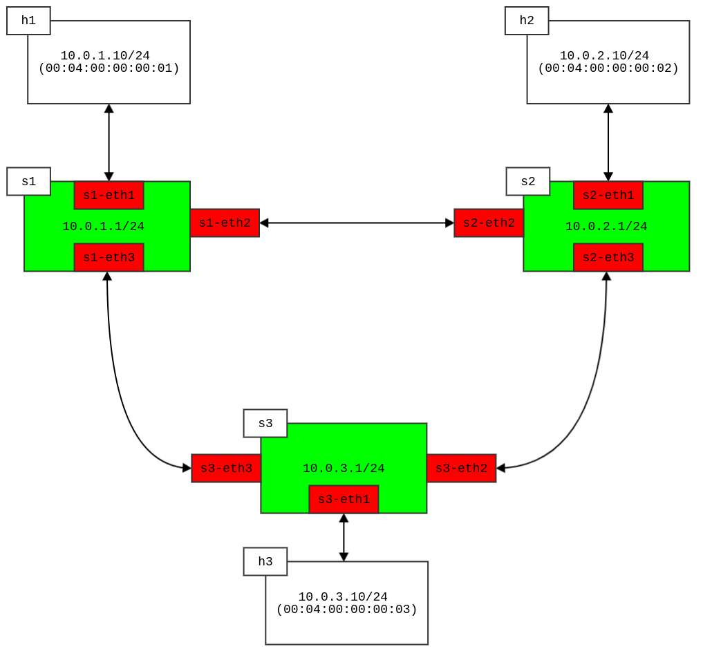

# Multiple Switch Demo

* 重現 SIGCOMM2017 教學、以及一些對 P4 程式的調整使用
* 主要以多個 switch 的模型為主
* 使用 mininet python 來實作 multiple switch 的 topo

## 練習

相關的練習使用，一些異質性高的檔案會放在不同名稱的資料夾當中做使用！

### `basic forwarding` 展示：
* switch 規則放置於 `basic_forwarding/` 底下
    * 可以透過呼叫該目錄底下的 `feed.sh` 來把 table rules 餵給 simple_switch
* 使用 `simple_router.p4` 做為 switch 使用的依據！
* 透過 `build.py` 做運行，透過手動的方式來建立網路 topo
    * 分別3個 switch:
        * `s1`:
            * ip: `10.0.1.1/24`
            * MAC: 
                * `s1-eth1`: `00:aa:bb:00:01:01`
                * `s1-eth2`: `00:aa:bb:00:01:02`
                * `s1-eth3`: `00:aa:bb:00:01:03`
        * `s2`:
            * ip: `10.0.2.1/24`
            * MAC:
                * `s2-eth1`: `00:aa:bb:00:02:02`
                * `s2-eth2`: `00:aa:bb:00:02:01`
                * `s2-eth3`: `00:aa:bb:00:02:03`
        * `s3`:
            * ip: `10.0.3.1/24`
            * MAC:
                * `s3-eth1`: `00:aa:bb:00:03:03`
                * `s3-eth2`: `00:aa:bb:00:03:02`
                * `s3-eth3`: `00:aa:bb:00:03:01`
* 運行範例：
    * 在運行 run_basic.sh 成功後，會進入 mininet CLI 做操作
    * 之後的測試跟之前的範例差不多，單純測試各個 host 間是否成功可以接收！
```bash
# 建立網路
sudo ./run_basic.sh
# (開啟另一個 terminal) 餵入腳本
cd basic_forwarding/ && ./feed.sh
```
* 架構表示：


### `MRI` Multi-hop route inspection 展示

* 進階操作！重現 SIGCOMM2017 當中 MRI 的範例！
    * 修改 P4 Program 做使用（加入額外的 header 來做到 MRI 的操作）
    * 新增 host：`h11`, `h22` 到 basic_forward 的網路模型裡頭
        * 新增的額外這組 host 用來產生大量封包（by `iperf`）
        * 由於使用的和 `h1` 到 `h2` 是同一條 link，所以我們可以在 `h2` 接收端上面看到，每個封包中攜帶的 switch 當下堵塞的狀況！（ `qdepth`）
    * 透過 mininet 提供的功能，來對 link 做 bandwidth 上的修改（讓封包在 `s1` 上產生壅塞）
* 如何使用：
    * 啟動腳本 `run_mri.sh`:
    ```bash
    # change mode
    chmod +x run_mri.sh
    # run !
    sudo ./run_mri.sh
    ```
    * 接著餵規則給目前的3個 switch!
    ```bash
    # change mode
    chmod +x mri/feed.sh
    # run !
    ./mri/feed.sh
    ```
    * 之後便可以進到 `run_mri.sh` 裡頭的 mininet CLI 當中，透過 `xterm h1 h11 h2 h22` 來開啟 4個 terminal 做各自的操作 （**由於操作有些不同，所以要用額外的 send, receive 程式**）
        * `h1` 一般傳送，並傳送 30 秒
            *  `./mri/send_mri.py <h2 IP> "P4" 30`
        * `h2` 一般接收
            *  `./mri/receive_mri.py`
        * `h11` 利用 *iperf* 傳送 udp 封包（沒有壅塞控制的限制）
            * `iperf -c <h22 IP> -t 15 -u`
        * `h22`
            * `iperf -s -u`
* 結果：
