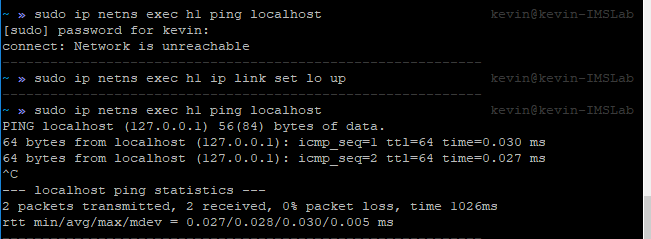
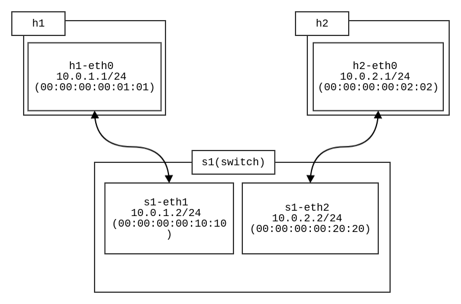

# Run directly

透過 Linux 提供的 `ip` 指令來建立虛擬的網路環境，並搭配 P4 程式來做最小化的實際應用

## Run

* 呼叫 `build.sh` 來做建立實驗環境（*Step1~Step4*）
    * 也就是下面 `build` 的腳本，詳細可以參考 `build/` 的資料夾！
    * 當 `build.sh` 完成後，會自動開啟 2 個 xterm 的 terminal 做使用，接下來就可以依據不同的 namespace 來做不同的事！
* 由 `build.sh` 建好環境後，這時候可以進入到 Step5, 6 進行手動操作！
    * 開啟任意 terminal 做操作，呼叫 simple_switch 來使用編譯好的 P4 程式 (參考 `Step5`)
    * 再開啟另一個 terminal 操作 simple_switch_CLI 來把 `basic_rules.txt` 的規則導入給 simple_switch 做使用！
    * 最後開啟 h1,h2 的 terminal， h1 使用 `./send.py <h2-port> "P4"`, h2 開啟 `./receive.py` 做封包 sniffing ，實現我們想要的 scenario!

* 最後使用完畢時，使用 `clearall.sh` 來清理實驗環境

## Build 

* Step 1: 建立各自獨立的 network namespace 

```bash
# 建立 host1
sudo ip netns add h1
# 建立 host 2
sudo ip netns add h2

# 這時可以透過 ls, list 來作檢查是否成功印出剛剛建立的 h1,h2
sudo ip netns ls
> h1
> h2
```

* Step 2: 在各自的 namespace 底下運行指令，看看剛建立的模樣
    * 格式: `ip netns exec <name of ns> <cmd>`
    * 在下面可以看到剛建立的 namespace 當中只有 loopback 的 interface 可以使用
    * 啟用 loopback 的 interface !
        
    * 如果想要額外建立其獨立的 terminal 做使用，可以在剛剛 `<cmd>` 的地方輸入 `bash` (參考下方)； 或是直接輸入 `xterm` 來開啟另一個新的視窗做使用（也方便區隔彼此）
```bash
# Execute command on h1
sudo ip netns exec h1 ip addr
> 
1: lo: <LOOPBACK> mtu 65536 qdisc noop state DOWN group default qlen 1000
    link/loopback 00:00:00:00:00:00 brd 00:00:00:00:00:00
# Enable localhost interface
sudo ip netns exec h1 ip link set lo up

# Open another shell process for h1
sudo ip netns exec h1 bash
> (here is h1 process now!)

# Or define the namespace name 
sudo ip netns exec h1 /bin/bash --rcfile <(echo "PS1=\"namespace h1> \"")

namespace h1>
```

到這裡我們擁有了兩個各自獨立的 namespace！ 接下來準備加入 namespace 間的通信

* Step 3: ~~建立第三個 namespace 作為 switch 使用~~
    * 讓對口留在本地端，方便之後的操作！（詳細請看最下面的問題區塊）
    * 利用兩條 veth pair 在這三個 namespace 中連結
    
    * 另外也可以透過 `ip link set <ethx> address <CUSTOM-MAC-ADDRESS>` 來設定自訂的 MAC Address ( 不然每次都會不一樣 )
```bash
# build first link: s1-eth1 <-> h1-eth0
sudo ip link add s1-eth1 type veth peer name h1-eth0
sudo ip link set h1-eth0 netns h1

# activate with IP address assign
sudo ip netns exec h1 ip link set h1-eth0 up
sudo ip netns exec h1 ip addr add 10.0.1.1/24 dev h1-eth0
sudo ip link set s1-eth1 up
sudo ip addr add 10.0.1.2/24 dev s1-eth1

# build second link: s1-eth2 <-> h2-eth0
sudo ip link add s1-eth2 type veth peer name h2-eth0
sudo ip link set s1-eth2 netns s1
sudo ip link set h2-eth0 netns h2

# activate with IP address assign
sudo ip netns exec h2 ip link set h2-eth0 up
sudo ip netns exec h2 ip addr add 10.0.2.1/24 dev h2-eth0
sudo ip link set s1-eth2 up
sudo ip addr add 10.0.2.2/24 dev s1-eth2
```

到這邊為止，可以建立出兩條互相沒有關聯的連線！（`h1-eth0` to `s1-eth1`, 以及 `h2-eth0` to `s1-eth2`）

* Step 4: 計劃 scenario, 編寫對應 P4 程式
    * 由於希望 h1, h2 能夠互通，所以我們程式需要建立 s1-eth1, s1-eth2 之間的橋樑
    * 實作基本轉傳 (forwarding) 功能!
    * `<補充>` 由於需要額外的 default routing table 給 h1, h2 內部，所以需要額外增加幾個 routing rules 到這兩個 host 裏面，分別是：
        * `h1`:
            * 預期結果
            ```
            default via 10.0.1.2 dev h1-eth0
            10.0.1.0/24 dev h1-eth0 proto kernel scope link src 10.0.1.1
            10.0.1.2 dev h1-eth0 scope link
            10.0.2.2 via 10.0.1.2 dev h1-eth0
            ```
            * 建立方式
            ```bash
            # add default gateway
            sudo ip route add default via 10.0.1.2
            ```
        * `h2`:
            * 預期結果
            ```
            default via 10.0.2.2 dev h1-eth0
            10.0.2.0/24 dev h2-eth0 proto kernel scope link src 10.0.2.1
            10.0.2.2 dev h2-eth0 scope link
            10.0.1.2 via 10.0.2.2 dev h2-eth0
            ```
            * 建立方式
            ```bash
            # add default gateway
            sudo ip route add default via 10.0.2.2
            ```
        * 這麼一來就可以讓兩邊互通！
    * 再來執行 compile
```bash
# Compile my P4 program
p4c-bm2-ss --p4v 16 forwarding.p4 -o forwarding.p4.json
```

* Step 5: 在 s1 的 namespace 當中開啟 bash process 做操作
    * 這邊嘗試透過 `simple_switch` 開啟剛剛建立的兩個 port（分別連接 h1, h2）
```bash
# Open terminal of s1
sudo ip netns exec s1 bash

# Execute simple_switch for use (in s1 process)
> sudo simple_switch -i 1@s1-eth1 -i 2@s1-eth2 --pcap --thrift-port 9090 --nanolog ipc:///tmp/bm-0-log.ipc --device-id 0 forwarding.p4.json --log-console
```

* Step 6: 開啟傳送封包的程式: `send.py`, `receive.py` 做使用，來檢查是否符合預期
    * 這邊和 `p4lang/tutorial/SIGCOMM2017/exercise` 中的使用方式雷同

* Step 7: 透過 `simple_switch_CLI` 加入規則！
    * 使用 simple_switch_CLI 讀取 basic_rules.txt 來匯入規則!
    ```bash
    simple_switch_CLI < basic_rules.txt
    ```

> 備註：
> 如果發生 delete namespace 後，再次呼叫其他程式（e.g. `p4-tutorial`）出現"仍然有 ethx 佔用的"的錯誤訊息發生時，可以呼叫 `sudo mn -c`，讓 mininet 的指令來幫忙做清除的工作

## Problems

* [Q1] 無法使用 simple_switch 指定 s1-eth1, s1-eth2 來做使用，目前沒辦法通
    * 釐清 simple_switch, simple_switch_CLI 使用
    * ~~`send.py`, `receive.py` 是否有問題？~~
* [A1] **問題解決**！ 有幾項錯誤釐清：
    * s1 的 namespace 不必建立，原因是如果建立在獨立的 namespace 當中的話，則後來呼叫 `simple_switch` 與 `simple_switch_CLI` 之間 thrift_server 連接會很麻煩
    * 再來就是上個問題的原因，之前測試錯誤都是因為我忽略了一個 simple_switch 給的錯誤訊息： `Add port operation failed`；這個錯誤訊息出現表示 simple_switch 在 attach interface 到 port 上時出了錯誤（找不到該名稱的 interface 做使用），所以後來我把腳本中 s1 的部份拿掉，讓對口留在本地端；之後就直接掉用 simple_switch 以及 simple_switch_CLI 即可！